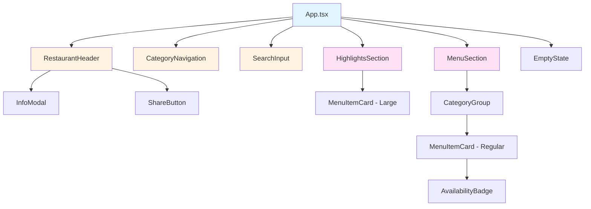
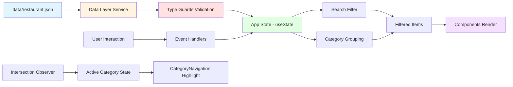

# Design Document - Menu Digital

## Overview

The Menu Digital is a modern, responsive digital menu system for restaurants built with React, TypeScript, and Vite. The system provides a data-driven architecture where categories and menu items are rendered from structured data without hardcoded JSX. The application features category navigation with scroll tracking, search functionality, highlights display, and comprehensive accessibility support.

### Core Objectives

1. **Data-Driven Architecture**: All content (restaurant info, categories, menu items) comes from structured data
2. **Type Safety**: Strong TypeScript typing throughout with custom type guards
3. **Responsive Design**: Mobile-first approach with breakpoints at 768px and 1024px
4. **Accessibility**: WCAG AA compliance with keyboard navigation and semantic HTML
5. **Property-Based Testing**: Critical business logic validated with fast-check
6. **Performance**: Efficient rendering with proper React patterns and lazy loading

### Technology Stack

- **React 18+**: UI library with hooks-based architecture
- **TypeScript 5+**: Type safety and developer experience
- **Vite**: Build tool and development server
- **CSS Modules**: Scoped styling with CSS variables for design tokens
- **fast-check**: Property-based testing library
- **Vitest**: Unit testing framework
- **React Testing Library**: Component testing
- **ESLint + Prettier**: Code quality tools

### Design Principles

1. **Separation of Concerns**: Clear boundaries between data, business logic, and presentation
2. **Composition over Inheritance**: Small, focused components composed together
3. **Pure Functions**: Business logic (filtering, formatting) as testable pure functions
4. **Progressive Enhancement**: Core functionality works, enhanced features layered on top
5. **Accessibility First**: Keyboard navigation and screen reader support built in from the start


## Architecture

### Component Hierarchy



### Component Responsibilities

#### Layout Components

**RestaurantHeader**
- Display restaurant name, logo/symbol, rating
- Show opening status with visual indicator
- Render Info and Share buttons
- Responsive layout (horizontal on desktop, compact on mobile)
- Props: `restaurant: Restaurant`

**CategoryNavigation**
- Display list of categories ordered by displayOrder
- Highlight active category based on scroll position
- Handle click to scroll to category
- Sticky sidebar (desktop) or horizontal scroll (mobile)
- Props: `categories: Category[]`, `activeCategory: string | null`, `onCategoryClick: (slug: string) => void`

**HighlightsSection**
- Display featured menu items
- Conditional rendering (only if featured items exist)
- Hidden during active search
- Responsive grid (desktop) or horizontal scroll (mobile)
- Props: `items: MenuItem[]`, `visible: boolean`

**MenuSection**
- Group menu items by category
- Render category headers with scroll targets
- Display items in responsive columns
- Props: `categories: Category[]`, `items: MenuItem[]`, `groupedItems: Map<string, MenuItem[]>`

#### UI Components

**MenuItemCard**
- Display item name, description, price, image
- Two size variants: regular and large (for highlights)
- Conditional image rendering
- Availability indicator integration
- Props: `item: MenuItem`, `variant: 'regular' | 'large'`

**SearchInput**
- Controlled input component
- Real-time filtering
- Clear button when query present
- Accessible label and placeholder
- Props: `value: string`, `onChange: (value: string) => void`, `onClear: () => void`

**AvailabilityBadge**
- Conditional rendering for unavailable items
- Visual indicator with text
- Props: `available: boolean`

**InfoModal**
- Accessible modal dialog
- Display restaurant address, phone, hours
- Close button and Escape key support
- Focus trap when open
- Props: `isOpen: boolean`, `onClose: () => void`, `restaurant: Restaurant`

**ShareButton**
- Detect Web Share API support
- Use navigator.share or clipboard fallback
- Display feedback toast on copy
- Props: `url: string`, `title: string`

**EmptyState**
- Display when search returns no results
- Friendly message with suggestion to modify search
- Props: `searchQuery: string`

### Component Props and Types

```typescript
// RestaurantHeader.tsx
interface RestaurantHeaderProps {
  restaurant: Restaurant;
}

// CategoryNavigation.tsx
interface CategoryNavigationProps {
  categories: Category[];
  activeCategory: string | null;
  onCategoryClick: (slug: string) => void;
}

// HighlightsSection.tsx
interface HighlightsSectionProps {
  items: MenuItem[];
  visible: boolean;
}

// MenuSection.tsx
interface MenuSectionProps {
  categories: Category[];
  items: MenuItem[];
  groupedItems: Map<string, MenuItem[]>;
}

// MenuItemCard.tsx
interface MenuItemCardProps {
  item: MenuItem;
  variant: 'regular' | 'large';
}

// SearchInput.tsx
interface SearchInputProps {
  value: string;
  onChange: (value: string) => void;
  onClear: () => void;
}

// AvailabilityBadge.tsx
interface AvailabilityBadgeProps {
  available: boolean;
}

// InfoModal.tsx
interface InfoModalProps {
  isOpen: boolean;
  onClose: () => void;
  restaurant: Restaurant;
}

// ShareButton.tsx
interface ShareButtonProps {
  url: string;
  title: string;
}

// EmptyState.tsx
interface EmptyStateProps {
  searchQuery: string;
}
```


## Data Flow

### Data Flow Architecture



### Data Flow Steps

1. **Data Loading** (App initialization)
   - Load `restaurant.json`, `categories.json`, `menu-items.json` from data layer
   - Validate data using type guards (throws error if invalid)
   - Store validated data in App component state

2. **Search Flow**
   - User types in SearchInput → triggers onChange handler
   - Update search query state
   - Call filterMenuItems(allItems, searchQuery) pure function
   - Update filteredItems state
   - Re-render MenuSection and HighlightsSection (hidden if query active)

3. **Category Navigation Flow**
   - User clicks category → onCategoryClick handler
   - Scroll to category section using ref.scrollIntoView()
   - Intersection Observer detects visible category
   - Update activeCategory state
   - Re-render CategoryNavigation with highlighted category

4. **Scroll Tracking Flow**
   - Intersection Observer monitors category sections
   - When section intersects viewport → callback fires
   - Update activeCategory state to current section slug
   - CategoryNavigation re-renders highlight

5. **Grouping Flow**
   - Filter items by search query (if active)
   - Group filtered items by categoryId
   - Filter categories to only those with items
   - Pass grouped data to MenuSection component

### State Management Strategy

The App component holds all primary state:

```typescript
function App() {
  // Data state
  const [restaurant, setRestaurant] = useState<Restaurant | null>(null);
  const [categories, setCategories] = useState<Category[]>([]);
  const [menuItems, setMenuItems] = useState<MenuItem[]>([]);
  
  // UI state
  const [searchQuery, setSearchQuery] = useState<string>('');
  const [activeCategory, setActiveCategory] = useState<string | null>(null);
  const [isInfoModalOpen, setIsInfoModalOpen] = useState<boolean>(false);
  
  // Derived state (computed from other state)
  const filteredItems = useMemo(
    () => filterMenuItems(menuItems, searchQuery),
    [menuItems, searchQuery]
  );
  
  const groupedItems = useMemo(
    () => groupItemsByCategory(filteredItems),
    [filteredItems]
  );
  
  const visibleCategories = useMemo(
    () => categories.filter(cat => groupedItems.has(cat.id)),
    [categories, groupedItems]
  );
  
  const featuredItems = useMemo(
    () => menuItems.filter(item => item.featured),
    [menuItems]
  );
  
  // ... render
}
```

### Custom Hooks

**useScrollspy**
- Manages Intersection Observer for category sections
- Returns activeCategory slug
- Cleanup on unmount

```typescript
function useScrollspy(categoryRefs: React.RefObject<HTMLElement>[], categoryIds: string[]) {
  const [activeId, setActiveId] = useState<string | null>(null);
  
  useEffect(() => {
    const observer = new IntersectionObserver(
      (entries) => {
        entries.forEach(entry => {
          if (entry.isIntersecting) {
            const index = categoryRefs.findIndex(ref => ref.current === entry.target);
            if (index !== -1) {
              setActiveId(categoryIds[index]);
            }
          }
        });
      },
      { rootMargin: '-20% 0px -70% 0px', threshold: 0 }
    );
    
    categoryRefs.forEach(ref => {
      if (ref.current) observer.observe(ref.current);
    });
    
    return () => observer.disconnect();
  }, [categoryRefs, categoryIds]);
  
  return activeId;
}
```

**useShareAPI**
- Detects Web Share API support
- Provides share function with fallback to clipboard
- Returns { share, canShare, feedback }

```typescript
function useShareAPI() {
  const [feedback, setFeedback] = useState<string | null>(null);
  const canShare = 'share' in navigator;
  
  const share = async (data: { title: string; url: string }) => {
    if (canShare) {
      try {
        await navigator.share(data);
      } catch (err) {
        if (err.name !== 'AbortError') {
          // Fallback to clipboard
          await navigator.clipboard.writeText(data.url);
          setFeedback('Link copiado!');
        }
      }
    } else {
      await navigator.clipboard.writeText(data.url);
      setFeedback('Link copiado!');
    }
    
    setTimeout(() => setFeedback(null), 3000);
  };
  
  return { share, canShare, feedback };
}
```


## Data Models

### TypeScript Interfaces

```typescript
// models/Restaurant.ts
export interface Restaurant {
  id: string;
  name: string;
  logo?: string; // Optional: URL to logo image or emoji/symbol
  rating: number; // 0-5
  isOpen: boolean;
  address: string;
  phone: string;
  openingHours?: string; // Display text, e.g., "Seg-Sex: 11h-23h"
}

// models/Category.ts
export interface Category {
  id: string;
  name: string;
  slug: string; // URL-friendly identifier for scrolling/linking
  displayOrder: number;
}

// models/MenuItem.ts
export interface MenuItem {
  id: string;
  categoryId: string; // Foreign key to Category.id
  name: string;
  slug: string; // URL-friendly identifier
  description?: string; // Optional description
  price: number; // Price in cents (e.g., 2990 = R$ 29,90) or BRL
  image?: string; // Optional image URL
  imageAlt?: string; // Required if image exists
  featured: boolean; // Whether to show in highlights
  available: boolean; // Availability status
  displayOrder: number;
}

// models/OpeningStatus.ts
export type OpeningStatus = 'open' | 'closed';

// Type guard functions
export function isRestaurant(data: unknown): data is Restaurant {
  if (typeof data !== 'object' || data === null) return false;
  const r = data as Record<string, unknown>;
  
  return (
    typeof r.id === 'string' &&
    typeof r.name === 'string' &&
    typeof r.rating === 'number' &&
    typeof r.isOpen === 'boolean' &&
    typeof r.address === 'string' &&
    typeof r.phone === 'string' &&
    (r.logo === undefined || typeof r.logo === 'string') &&
    (r.openingHours === undefined || typeof r.openingHours === 'string')
  );
}

export function isCategory(data: unknown): data is Category {
  if (typeof data !== 'object' || data === null) return false;
  const c = data as Record<string, unknown>;
  
  return (
    typeof c.id === 'string' &&
    typeof c.name === 'string' &&
    typeof c.slug === 'string' &&
    typeof c.displayOrder === 'number'
  );
}

export function isMenuItem(data: unknown): data is MenuItem {
  if (typeof data !== 'object' || data === null) return false;
  const m = data as Record<string, unknown>;
  
  const baseValid = (
    typeof m.id === 'string' &&
    typeof m.categoryId === 'string' &&
    typeof m.name === 'string' &&
    typeof m.slug === 'string' &&
    typeof m.price === 'number' &&
    typeof m.featured === 'boolean' &&
    typeof m.available === 'boolean' &&
    typeof m.displayOrder === 'number'
  );
  
  if (!baseValid) return false;
  
  // Validate optional fields
  if (m.description !== undefined && typeof m.description !== 'string') return false;
  if (m.image !== undefined && typeof m.image !== 'string') return false;
  if (m.imageAlt !== undefined && typeof m.imageAlt !== 'string') return false;
  
  // If image exists, imageAlt should exist
  if (typeof m.image === 'string' && typeof m.imageAlt !== 'string') return false;
  
  return true;
}

export function isCategoryArray(data: unknown): data is Category[] {
  return Array.isArray(data) && data.every(isCategory);
}

export function isMenuItemArray(data: unknown): data is MenuItem[] {
  return Array.isArray(data) && data.every(isMenuItem);
}
```

### Validation Strategy

**When to Validate:**
- On data load from JSON files (services/dataLoader.ts)
- Before passing data to components

**Validation Function:**

```typescript
// services/dataValidator.ts
export class ValidationError extends Error {
  constructor(message: string) {
    super(message);
    this.name = 'ValidationError';
  }
}

export function validateRestaurant(data: unknown): Restaurant {
  if (!isRestaurant(data)) {
    throw new ValidationError('Invalid restaurant data structure');
  }
  
  if (data.rating < 0 || data.rating > 5) {
    throw new ValidationError('Restaurant rating must be between 0 and 5');
  }
  
  return data;
}

export function validateCategories(data: unknown): Category[] {
  if (!isCategoryArray(data)) {
    throw new ValidationError('Invalid categories data structure');
  }
  
  // Check for duplicate IDs
  const ids = data.map(c => c.id);
  if (new Set(ids).size !== ids.length) {
    throw new ValidationError('Duplicate category IDs found');
  }
  
  return data;
}

export function validateMenuItems(data: unknown): MenuItem[] {
  if (!isMenuItemArray(data)) {
    throw new ValidationError('Invalid menu items data structure');
  }
  
  // Check for duplicate IDs
  const ids = data.map(m => m.id);
  if (new Set(ids).size !== ids.length) {
    throw new ValidationError('Duplicate menu item IDs found');
  }
  
  return data;
}
```

### Utility Types

```typescript
// models/types.ts

// Type for grouped menu items by category
export type GroupedMenuItems = Map<string, MenuItem[]>;

// Type for search filter function
export type FilterFunction = (items: MenuItem[], query: string) => MenuItem[];

// Type for price formatter function
export type PriceFormatter = (price: number) => string;

// Props type helpers
export type PropsWithClassName<P = {}> = P & { className?: string };
```


## Directory Structure

```
menu-digital/
├── .kiro/
│   └── specs/
│       └── menu-digital/
│           ├── .config.kiro
│           ├── requirements.md
│           └── design.md (this file)
├── public/
│   └── (static assets)
├── src/
│   ├── assets/
│   │   ├── images/
│   │   └── (other static files)
│   │
│   ├── components/
│   │   ├── layout/
│   │   │   ├── RestaurantHeader/
│   │   │   │   ├── RestaurantHeader.tsx
│   │   │   │   ├── RestaurantHeader.module.css
│   │   │   │   └── RestaurantHeader.test.tsx
│   │   │   ├── CategoryNavigation/
│   │   │   │   ├── CategoryNavigation.tsx
│   │   │   │   ├── CategoryNavigation.module.css
│   │   │   │   └── CategoryNavigation.test.tsx
│   │   │   ├── HighlightsSection/
│   │   │   │   ├── HighlightsSection.tsx
│   │   │   │   ├── HighlightsSection.module.css
│   │   │   │   └── HighlightsSection.test.tsx
│   │   │   ├── MenuSection/
│   │   │   │   ├── MenuSection.tsx
│   │   │   │   ├── MenuSection.module.css
│   │   │   │   └── MenuSection.test.tsx
│   │   │   └── index.ts
│   │   │
│   │   ├── menu/
│   │   │   ├── MenuItemCard/
│   │   │   │   ├── MenuItemCard.tsx
│   │   │   │   ├── MenuItemCard.module.css
│   │   │   │   └── MenuItemCard.test.tsx
│   │   │   └── index.ts
│   │   │
│   │   └── ui/
│   │       ├── SearchInput/
│   │       │   ├── SearchInput.tsx
│   │       │   ├── SearchInput.module.css
│   │       │   └── SearchInput.test.tsx
│   │       ├── EmptyState/
│   │       │   ├── EmptyState.tsx
│   │       │   ├── EmptyState.module.css
│   │       │   └── EmptyState.test.tsx
│   │       ├── AvailabilityBadge/
│   │       │   ├── AvailabilityBadge.tsx
│   │       │   ├── AvailabilityBadge.module.css
│   │       │   └── AvailabilityBadge.test.tsx
│   │       ├── InfoModal/
│   │       │   ├── InfoModal.tsx
│   │       │   ├── InfoModal.module.css
│   │       │   └── InfoModal.test.tsx
│   │       ├── ShareButton/
│   │       │   ├── ShareButton.tsx
│   │       │   ├── ShareButton.module.css
│   │       │   └── ShareButton.test.tsx
│   │       └── index.ts
│   │
│   ├── data/
│   │   ├── restaurant.json
│   │   ├── categories.json
│   │   └── menu-items.json
│   │
│   ├── hooks/
│   │   ├── useScrollspy.ts
│   │   ├── useScrollspy.test.ts
│   │   ├── useShareAPI.ts
│   │   └── useShareAPI.test.ts
│   │
│   ├── models/
│   │   ├── Restaurant.ts
│   │   ├── Category.ts
│   │   ├── MenuItem.ts
│   │   ├── types.ts
│   │   └── index.ts
│   │
│   ├── services/
│   │   ├── dataLoader.ts
│   │   ├── dataLoader.test.ts
│   │   ├── dataValidator.ts
│   │   └── dataValidator.test.ts
│   │
│   ├── styles/
│   │   ├── globals.css
│   │   ├── variables.css (design tokens)
│   │   └── reset.css
│   │
│   ├── utils/
│   │   ├── formatPrice.ts
│   │   ├── formatPrice.test.ts
│   │   ├── formatPrice.property.test.ts (property-based)
│   │   ├── filterMenuItems.ts
│   │   ├── filterMenuItems.test.ts
│   │   ├── filterMenuItems.property.test.ts (property-based)
│   │   ├── groupByCategory.ts
│   │   └── groupByCategory.test.ts
│   │
│   ├── App.tsx
│   ├── App.module.css
│   ├── App.test.tsx
│   ├── main.tsx
│   └── vite-env.d.ts
│
├── .eslintrc.cjs
├── .prettierrc
├── .gitignore
├── index.html
├── package.json
├── tsconfig.json
├── tsconfig.node.json
├── vite.config.ts
├── vitest.config.ts
├── README.md
└── LICENSE
```

### Directory Purposes

**`src/components/layout/`**
- Major layout sections of the application
- Components that structure the page (header, navigation, main sections)
- Each component in its own folder with `.tsx`, `.module.css`, and `.test.tsx`

**`src/components/menu/`**
- Menu-specific components (MenuItemCard)
- Components directly related to displaying menu data

**`src/components/ui/`**
- Reusable UI components (SearchInput, Modal, Button, Badge, EmptyState)
- Generic components that could be used in other contexts

**`src/data/`**
- JSON files containing restaurant, category, and menu item data
- Source of truth for content (v1: local JSON, v2: could be API responses)

**`src/hooks/`**
- Custom React hooks
- Reusable stateful logic (useScrollspy, useShareAPI)
- Each hook with corresponding test file

**`src/models/`**
- TypeScript type definitions and interfaces
- Type guards for runtime validation
- Utility types

**`src/services/`**
- Business logic layer
- Data loading and validation functions
- Separate from component logic

**`src/styles/`**
- Global styles, CSS reset, design tokens
- `variables.css` contains all CSS custom properties (colors, spacing, typography, breakpoints)

**`src/utils/`**
- Pure utility functions (formatPrice, filterMenuItems, groupByCategory)
- Each function with unit tests and property-based tests where applicable


## Responsive Design Strategy

### Breakpoints

```css
/* styles/variables.css */
:root {
  /* Breakpoints */
  --breakpoint-mobile: 768px;
  --breakpoint-tablet: 1024px;
  
  /* Validation widths for testing */
  --width-mobile-min: 360px;
  --width-tablet: 768px;
  --width-desktop-min: 1024px;
  --width-desktop-large: 1440px;
}
```

**Viewport Definitions:**
- **Mobile**: < 768px (primary target: 360px - 767px)
- **Tablet**: 768px - 1023px
- **Desktop**: ≥ 1024px (test at 1024px and 1440px)

### Design Tokens

```css
/* styles/variables.css */
:root {
  /* Spacing Scale (8px base) */
  --space-xs: 0.25rem;  /* 4px */
  --space-sm: 0.5rem;   /* 8px */
  --space-md: 1rem;     /* 16px */
  --space-lg: 1.5rem;   /* 24px */
  --space-xl: 2rem;     /* 32px */
  --space-2xl: 3rem;    /* 48px */
  --space-3xl: 4rem;    /* 64px */
  
  /* Typography Scale */
  --font-size-xs: 0.75rem;   /* 12px */
  --font-size-sm: 0.875rem;  /* 14px */
  --font-size-base: 1rem;    /* 16px */
  --font-size-lg: 1.125rem;  /* 18px */
  --font-size-xl: 1.25rem;   /* 20px */
  --font-size-2xl: 1.5rem;   /* 24px */
  --font-size-3xl: 1.875rem; /* 30px */
  --font-size-4xl: 2.25rem;  /* 36px */
  
  --font-weight-normal: 400;
  --font-weight-medium: 500;
  --font-weight-semibold: 600;
  --font-weight-bold: 700;
  
  --line-height-tight: 1.25;
  --line-height-normal: 1.5;
  --line-height-relaxed: 1.75;
  
  /* Colors - Define according to visual identity */
  --color-primary: #your-brand-color;
  --color-secondary: #your-secondary-color;
  --color-background: #ffffff;
  --color-surface: #f9fafb;
  --color-text-primary: #111827;
  --color-text-secondary: #6b7280;
  --color-text-muted: #9ca3af;
  --color-border: #e5e7eb;
  --color-success: #10b981;
  --color-error: #ef4444;
  --color-warning: #f59e0b;
  
  /* Status colors */
  --color-status-open: #10b981;
  --color-status-closed: #ef4444;
  --color-unavailable: #9ca3af;
  
  /* Shadows */
  --shadow-sm: 0 1px 2px 0 rgb(0 0 0 / 0.05);
  --shadow-md: 0 4px 6px -1px rgb(0 0 0 / 0.1);
  --shadow-lg: 0 10px 15px -3px rgb(0 0 0 / 0.1);
  
  /* Border Radius */
  --radius-sm: 0.25rem;  /* 4px */
  --radius-md: 0.5rem;   /* 8px */
  --radius-lg: 0.75rem;  /* 12px */
  --radius-xl: 1rem;     /* 16px */
  --radius-full: 9999px;
  
  /* Touch Targets */
  --touch-target-min: 44px;
  
  /* Transitions */
  --transition-fast: 150ms ease;
  --transition-base: 200ms ease;
  --transition-slow: 300ms ease;
  
  /* Z-index Scale */
  --z-base: 0;
  --z-dropdown: 100;
  --z-sticky: 200;
  --z-modal-backdrop: 900;
  --z-modal: 1000;
  --z-toast: 1100;
}
```

### Component Responsive Adaptations

#### RestaurantHeader

**Mobile (<768px):**
- Compact vertical or stacked layout
- Logo/name at top
- Status, rating below
- Info and Share buttons inline or stacked
- Font sizes: name (--font-size-xl), rating (--font-size-sm)

**Desktop (≥1024px):**
- Horizontal layout with flexbox
- Logo/name on left
- Status and rating centered or right-aligned
- Buttons on far right
- Font sizes: name (--font-size-3xl), rating (--font-size-base)

```css
/* RestaurantHeader.module.css */
.header {
  display: flex;
  flex-direction: column;
  gap: var(--space-md);
  padding: var(--space-lg);
}

@media (min-width: 768px) {
  .header {
    flex-direction: row;
    align-items: center;
    justify-content: space-between;
    padding: var(--space-xl);
  }
}
```

#### CategoryNavigation

**Mobile (<768px):**
- Horizontal scrollable list
- Sticky to top of viewport
- Touch-friendly buttons (min 44px height)
- Snap scroll for smooth UX
- Hide scrollbar or minimal scrollbar

**Tablet (768-1023px):**
- Could be horizontal at top or switch to sidebar
- Depends on design preference

**Desktop (≥1024px):**
- Fixed sidebar on left (position: sticky)
- Vertical list of categories
- Max width ~200-250px
- Hover states on categories

```css
/* CategoryNavigation.module.css */
.nav {
  display: flex;
  overflow-x: auto;
  gap: var(--space-sm);
  padding: var(--space-md);
  position: sticky;
  top: 0;
  background: var(--color-background);
  z-index: var(--z-sticky);
  scrollbar-width: thin;
  scroll-snap-type: x proximity;
}

.navItem {
  flex-shrink: 0;
  min-height: var(--touch-target-min);
  scroll-snap-align: start;
}

@media (min-width: 1024px) {
  .nav {
    flex-direction: column;
    overflow-x: visible;
    max-width: 250px;
    height: fit-content;
    top: var(--space-xl);
  }
}
```

#### HighlightsSection

**Mobile (<768px):**
- Horizontal scroll container
- Cards display inline
- Scroll snap for smoother UX
- Show ~1.2 cards at a time to hint at scroll

**Desktop (≥1024px):**
- Grid layout (2 or 3 columns)
- Or horizontal layout with all visible

```css
/* HighlightsSection.module.css */
.highlights {
  display: flex;
  overflow-x: auto;
  gap: var(--space-md);
  padding: var(--space-lg);
  scroll-snap-type: x mandatory;
}

.highlightCard {
  flex: 0 0 85%;
  scroll-snap-align: start;
}

@media (min-width: 768px) {
  .highlightCard {
    flex: 0 0 45%;
  }
}

@media (min-width: 1024px) {
  .highlights {
    display: grid;
    grid-template-columns: repeat(auto-fit, minmax(300px, 1fr));
    overflow-x: visible;
  }
  
  .highlightCard {
    flex: initial;
  }
}
```

#### MenuSection

**Mobile (<768px):**
- 1 column layout
- Full width cards
- Adequate padding between items

**Tablet (768-1023px):**
- Could be 2 columns or stay 1 column
- Design preference

**Desktop (≥1024px):**
- 2 column grid
- Gap between columns

```css
/* MenuSection.module.css */
.menuGrid {
  display: grid;
  grid-template-columns: 1fr;
  gap: var(--space-lg);
  padding: var(--space-lg);
}

@media (min-width: 1024px) {
  .menuGrid {
    grid-template-columns: repeat(2, 1fr);
    padding: var(--space-xl);
  }
}
```

### Preventing Horizontal Overflow

```css
/* globals.css */
* {
  box-sizing: border-box;
}

html,
body {
  overflow-x: hidden;
  width: 100%;
}

img {
  max-width: 100%;
  height: auto;
}
```

### Touch Target Sizes

All interactive elements (buttons, links, inputs) must meet minimum 44x44px touch target:

```css
.button,
.link,
.input {
  min-height: var(--touch-target-min);
  min-width: var(--touch-target-min);
  padding: var(--space-sm) var(--space-md);
}
```

### Image Handling

```css
.menuItemImage {
  width: 100%;
  height: 200px;
  object-fit: cover;
  border-radius: var(--radius-lg);
  loading: lazy; /* Native lazy loading */
}

@media (min-width: 1024px) {
  .menuItemImage {
    height: 250px;
  }
}
```


## Category Navigation Implementation

### Scroll-to-Category Mechanism

**Implementation using scrollIntoView:**

```typescript
// CategoryNavigation.tsx
interface CategoryNavigationProps {
  categories: Category[];
  activeCategory: string | null;
  onCategoryClick: (slug: string) => void;
}

function CategoryNavigation({ categories, activeCategory, onCategoryClick }: CategoryNavigationProps) {
  const handleCategoryClick = (slug: string) => {
    // Find the section element
    const section = document.getElementById(`category-${slug}`);
    if (section) {
      section.scrollIntoView({ 
        behavior: 'smooth', 
        block: 'start',
        inline: 'nearest'
      });
    }
    onCategoryClick(slug);
  };
  
  return (
    <nav className={styles.nav} aria-label="Categorias do menu">
      {categories.map(category => (
        <button
          key={category.id}
          onClick={() => handleCategoryClick(category.slug)}
          className={cn(styles.navItem, {
            [styles.active]: activeCategory === category.slug
          })}
          aria-current={activeCategory === category.slug ? 'true' : undefined}
        >
          {category.name}
        </button>
      ))}
    </nav>
  );
}
```

**Menu Section with Scroll Targets:**

```typescript
// MenuSection.tsx
function MenuSection({ categories, groupedItems }: MenuSectionProps) {
  return (
    <div className={styles.menuContainer}>
      {categories.map(category => {
        const items = groupedItems.get(category.id);
        if (!items || items.length === 0) return null;
        
        return (
          <section
            key={category.id}
            id={`category-${category.slug}`}
            className={styles.categorySection}
            aria-labelledby={`category-heading-${category.slug}`}
          >
            <h2 id={`category-heading-${category.slug}`} className={styles.categoryHeading}>
              {category.name}
            </h2>
            <div className={styles.menuGrid}>
              {items.map(item => (
                <MenuItemCard key={item.id} item={item} variant="regular" />
              ))}
            </div>
          </section>
        );
      })}
    </div>
  );
}
```

### Scroll Tracking with Intersection Observer

**Custom Hook Implementation:**

```typescript
// hooks/useScrollspy.ts
export function useScrollspy(
  categoryRefs: React.RefObject<HTMLElement>[],
  categoryIds: string[],
  options?: IntersectionObserverInit
): string | null {
  const [activeId, setActiveId] = useState<string | null>(null);
  
  useEffect(() => {
    const defaultOptions: IntersectionObserverInit = {
      // Trigger when section is in the upper portion of viewport
      rootMargin: '-20% 0px -70% 0px',
      threshold: 0,
      ...options
    };
    
    const observer = new IntersectionObserver((entries) => {
      // Find the first intersecting entry
      const intersectingEntry = entries.find(entry => entry.isIntersecting);
      
      if (intersectingEntry) {
        const index = categoryRefs.findIndex(
          ref => ref.current === intersectingEntry.target
        );
        
        if (index !== -1) {
          setActiveId(categoryIds[index]);
        }
      }
    }, defaultOptions);
    
    // Observe all category sections
    categoryRefs.forEach(ref => {
      if (ref.current) {
        observer.observe(ref.current);
      }
    });
    
    return () => {
      observer.disconnect();
    };
  }, [categoryRefs, categoryIds, options]);
  
  return activeId;
}
```

**Usage in App:**

```typescript
// App.tsx
function App() {
  const [searchQuery, setSearchQuery] = useState('');
  const [categories, setCategories] = useState<Category[]>([]);
  const [menuItems, setMenuItems] = useState<MenuItem[]>([]);
  
  // Create refs for each category section
  const categoryRefs = useRef<React.RefObject<HTMLElement>[]>([]);
  
  useEffect(() => {
    categoryRefs.current = categories.map((_, i) => 
      categoryRefs.current[i] || createRef<HTMLElement>()
    );
  }, [categories]);
  
  // Get active category from scroll position
  const activeCategory = useScrollspy(
    categoryRefs.current,
    categories.map(c => c.slug)
  );
  
  const handleCategoryClick = (slug: string) => {
    // Scroll handled in CategoryNavigation component
  };
  
  return (
    <div className={styles.app}>
      <RestaurantHeader restaurant={restaurant} />
      
      <div className={styles.layout}>
        <CategoryNavigation
          categories={visibleCategories}
          activeCategory={activeCategory}
          onCategoryClick={handleCategoryClick}
        />
        
        <main className={styles.main}>
          <SearchInput
            value={searchQuery}
            onChange={setSearchQuery}
            onClear={() => setSearchQuery('')}
          />
          
          {!searchQuery && (
            <HighlightsSection items={featuredItems} visible={true} />
          )}
          
          <MenuSection
            categories={visibleCategories}
            groupedItems={groupedItems}
            refs={categoryRefs.current}
          />
        </main>
      </div>
    </div>
  );
}
```

### Active Category Visual Styling

```css
/* CategoryNavigation.module.css */
.navItem {
  padding: var(--space-sm) var(--space-md);
  background: transparent;
  border: none;
  border-bottom: 2px solid transparent;
  color: var(--color-text-secondary);
  font-weight: var(--font-weight-medium);
  cursor: pointer;
  transition: all var(--transition-base);
  min-height: var(--touch-target-min);
}

.navItem:hover {
  color: var(--color-text-primary);
  background: var(--color-surface);
}

.navItem:focus-visible {
  outline: 2px solid var(--color-primary);
  outline-offset: 2px;
}

.navItem.active {
  color: var(--color-primary);
  border-bottom-color: var(--color-primary);
  font-weight: var(--font-weight-semibold);
}

@media (min-width: 1024px) {
  .navItem {
    border-bottom: none;
    border-left: 3px solid transparent;
    text-align: left;
    width: 100%;
  }
  
  .navItem.active {
    border-left-color: var(--color-primary);
    background: var(--color-surface);
  }
}
```

### Keyboard Navigation Support

Category navigation supports:
- **Tab / Shift+Tab**: Move between category buttons
- **Enter / Space**: Activate category (scroll to section)
- **Arrow Keys**: Not implemented (standard button behavior is sufficient)

Focus indicators are always visible via `:focus-visible` styles.

